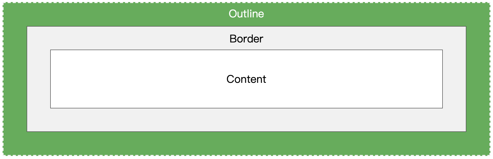

# Outline
1. A line around elements
2. Outside the borders
3. To make the element stand out
4. May overlap other elements
5. Is not a part of element's dimensions
6. Will not affect the width and height of element

## Property
1. outline
2. outline-style
   1. dotted
   2. dashed
   3. solid
   4. double
   5. groove
   6. ridge
   7. inset
   8. outset
   9. none
   10. hidden
**following property will not effect if no outline-style**
3. outline-color
   1. name
   2. HEX
   3. RGB
   4. HSL
   5. invert
4. outline-width
   1. thin(1px)
   2. medium(3px)
   3. thick(5px)
   4. length(px,pt,em,etc)
5. outline-offset
   1. Add space between outline and border
   2. Is transparent
 