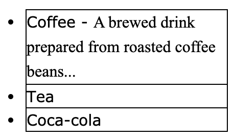
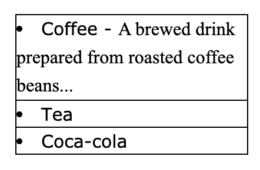

# List

## Ordered Lists
1. Use `<ol>` to mark items with numbers or letters
```html
<ol>
    <li>item1</li>
    <li>item2</li>
    <ol>
        <li>item3</li>
    </ol>
</ol>
```
<ol>
    <li>item1</li>
    <li>item2</li>
    <ol>
        <li>item3</li>
    </ol>
</ol>

## Unordered Lists
1. Use `<ul>` to mark items with bullets
```html
<ul>
    <li>item1</li>
    <li>item2</li>
    <ul>
        <li>item3</li>
    </ul>
</ul>
```
<ul>
    <li>item1</li>
    <li>item2</li>
    <ul>
        <li>item3</li>
    </ul>
</ul>

## CSS properties
1. Css list properties allow you to:
   1. Set different list item markers for ordered lists
   2. Set different list item markers for unordered liets
   3. Set an image as the list item marker
   4. Add background colors to lists and list items

## Different list item markers
1. Use `list-style-type` to specify the type of list item marker
```css
ul.a{
    list-style-type:circle;
}
ul.b{
    list-style-type:square;
}
ol.c{
    list-style-type:upper-roman;
}
ol.d{
    list-style-type:lower-alpha;
}
```

## Image as the list item marker
1. Use `lisy-style-image` to specify image as list item marker
```css
ul{
    list-style-image:url('square.gif');
}
```

## Position the list item markers
1. Use `list-style-position` to specify the position of the list-item markers
2. Values:
   1. `outside`(Default):The bullet points will be outside the list item.The start of each line of a list item will be aligned vertically.
      
   2. `inside`:The bullet points will be inside the list item. As it is part of list item, it will be part of the text and push the text at the start
      

## Remove default settings
```css
ul{
    list-style-type:none;
    margin:0;
    padding:0;
}
```

## Shorthand property
1. `list-style` is a shorthand property to set all list properties in one declaration
2. The order of the property are:`list-style-type`=>`list-style-position`=>`list-style-image`
   ```css
   ul{
       list-style:square inside url(square.gif);
   }
   ```

# Styling list
1. Anything added to `<ul>` or `<ol>` affects the entire list
2. Property added to `<li>` will affect the individual list item