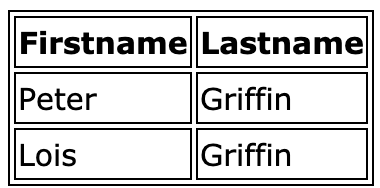
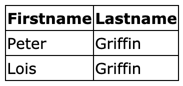

# Table

## Border
1. Set `border` to `<table>`,`<th>` or `<td>` will add border to these elements
   ```css
   table, th, td{
       border :1px solid black;
   }
   ```
   

## Collapse table border
1. Use `border-collapse` to set whether the table borders should be collapsed into a single border
   ```css
   table, th, td{
       border:1px solid black;
   }
   table{
       border-collapse:collapse;
   }
   ```
   

## Vertical alignment
1. The `vertical-align` property sets the vertical alignment(top, bottom, or middle) of the content in `<th>` or `<td>`
2. `middle`-default
   ```css
   td{
       height:50px;
       vertical-align:bottom;
   }
   ```

## Responsive table
1. A responsive table will display a horizontal scroll bar if the screen is too small to display the full content
2. Add a container element(like `<div>`) with `overflow-x :auto` around the `<table>` element to make it responsive
   ```html
    <div overflow-x:"auto;">
        <table>
            ... table content ...
        </table>
    <div>
   ``` 

## Other properties
1. `border-spacing`-Specify the distance between the borders of adjedcent cells
2. `caption-side`-Specify the placement of a table caption
   1. `top`
   2. `bottom`
   3. `initial`
   4. `inherit`
3. `empty-cells`-Specify whether or not to display borders and background on empty cells in a table
   1. `show`
   2. `hide`
   3. `initial`
   4. `inherit`
4. `table-layout`-Set the layout algorithm to be used for a table
   1. `auto`-Browser use an automatic table layout algorithm.The column width is set by the **widest unbreakable content** in the cells.The content will dictate the layout
   2. `fixed`-Sets a fixed table layout algorithm.The table and column widths are set by the widths of table and col or by the width of the first row of cells.Cells in the other rows do not affect column widths.If no widths are present on the first row,the column width are divided equally across the table,regardless of content inside the cells.
   3. **Tips**:The main benefit of table-layout:fixed; is that the table renders much faster.On large table ,users will not see any part of the table untill browser has rendered the whole table.So,if you use table-layout:fixed ,user will see the top of the table while the browser loads and renders rest of the table.This gives the impression that the page loads a lot quicker!