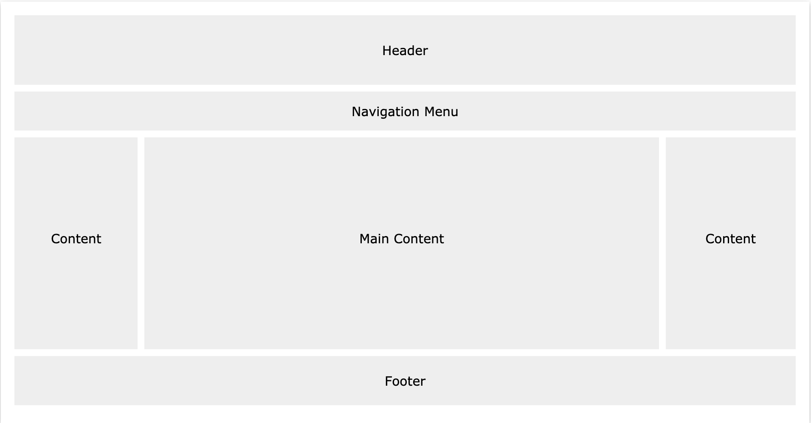
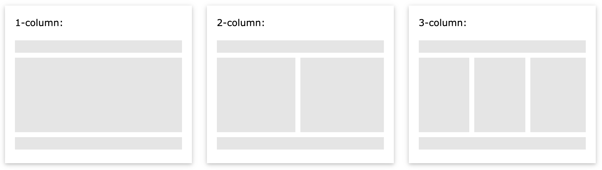

# CSS Website Layout
A website is often divided into headers,menus,content and a footer.


There are tons of different layout designed to choose from.
However,the structure above, is one of the most common,and we will take a closer look at it in the tutorial.

## Header
A header is usually located at the top of the website(or right below a top navigation menu).
It often contains a logo or the website name.
```css
.header{
    background-color:#F1F1F1;
    text-align:center;
    padding:20px;
}
```

## Navigation Bar
A navigation bar contains a list of links to help visitors navigating through your website.
```css
.topnav{
    overflow:hidden;
    background-color:#333;
}
.topnav::after{
    content:"";
    display:block;
    clear:both;
}
.topnav a{
    float:left;
    display:block;
    color:#f2f2f2;
    text-align:center;
    padding:14px 16px;
    text-decoration:none;
}
.topnav a:hover{
    background-color:#ddd;
    color:black;
}
```

## Content:
The layout in this section ,often depends on the target users.
The most common layout is one(or combining them)of the following:

- 1-column (often used for mobile browser)
- 2-column (often used for tablets or laptop)
- 3-column (often used for desktop)

We can create a 3-column layout,and change it to 1-column layout when the screen shrink.



## Content-Uniqual Columns
The main content is the biggest and the most important part of your site.
It is common with **uniqual** column widths,so that most of the space is reserved for the main content.
Ths side content(if any) is often used as an alternative navigation or to specify information relevant to the main content.
Change the widths as you like ,only remember that it should add up to 100% in total.

## Footer
The footer is placed at the bottom of your page.
It often contains information like copyright and contact info.

## Responsive Website Layout
By using some of the CSS code above,we have created a responsive website layout,which varies between two columns and full-width columns depending on screen width.