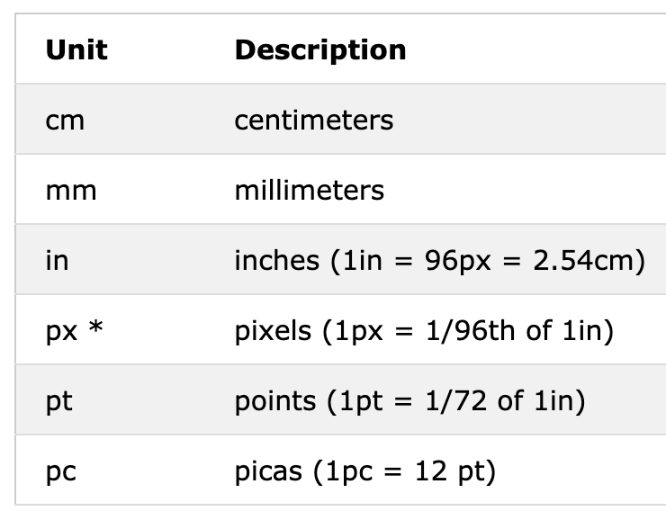
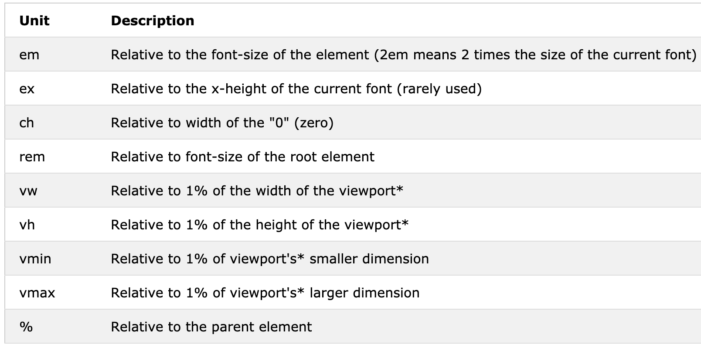

# CSS Unit
CSS has several different units for expressing a length.
Many CSS properties take "length" values,such as `width`,`margin`,`padding`,`font-size` ,etc.
Length is a number followed by a length unit,such as 10px,2em,etc.
A whitespace **cannot** appear between the number and the unit.
However ,if the value is 0,the unit can be ommited.
There are two types of length units:absolute and relative.

## Absolute Lengths
The absolute length units are fixed and a length expressed in any of these will appear as exactly that size.
Absolute length units are not recommended for use on screen,because screen sizes vary so much.
However ,they can be used if the output medium is known,such as for print layout.

> **Note**:Pixels(px) are **relative** to the **viewing device**.
> For **low-dpi** devices, 1px is one device pixel (dot) of the display.
> For printers and high resolution screen 1px implies multiple device pixels.

## Relative Lengths
Relative length units specify a length **relative** to another length property.
Relative length units scales **better** between **different rendering medium**.

> **Tip**:The em and rem units are pratical in creating perfectly scalable layout!
> *Viewport = the browser window size.If the viewport is 50cm wide ,1vw=0.5cm.

<iframe height="265" style="width: 100%;" scrolling="no" title="Length Units" src="https://codepen.io/orientalist/embed/eYNxOaL?height=265&theme-id=dark&default-tab=html,result" frameborder="no" allowtransparency="true" allowfullscreen="true">
  See the Pen <a href='https://codepen.io/orientalist/pen/eYNxOaL'>Length Units</a> by orientalist
  (<a href='https://codepen.io/orientalist'>@orientalist</a>) on <a href='https://codepen.io'>CodePen</a>.
</iframe>