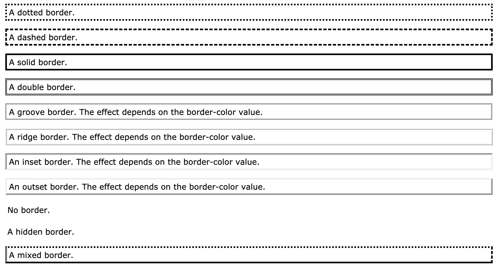

# Border
1. `border-style`
   1. `dotted`
   2. `dashed`
   3. `solid`
   4. `double`
   5. `groove`
   6. `ridge`
   7. `inset`
   8. `outset`
   9. `none`
   10. `hidden`
2.  The `border-style` can have one to four uppon value(top,right,bottom,left)

3. The following properties will not have effect if the `border-style` is not setted
   1. `border-width` specify the width of four width(top,right,bottom,left)
      1. Can be set as a specific size(px,pt,cm,em,etc) or pre-defined value thin,medium,thick
   2. `border-color` specify the color of four color(top,right,bottom,left)
      1. Can be 
         1. name(red)
         2. HEX(#ff0000)
         3. RGB(rgb(255,0,0))
         4. HSL(hsl(0,100%,50%))
         5. transparent
      2. If not set,it inherit the color of element
   3. `border-{side}-style`
      1. The side can be top,right,bottom and left
      2. The values are as values of `border-style`
4. `border-radius`
   1. User to add rounded border
      ```css
      h1{
          border:1px solid black;
          border-radius:10px;
      }
      ```

## Shorthand
1. Syntax:
   ```css
   h1{
       border:{border-width} {border-style} {border-color}; 
   }
   ```
2. Set border for only one side
   ```css
   h1{
       border-left:6px solid red;
   }
   ```
