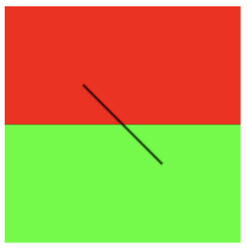
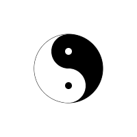

# Canvas
1. Since Html5
2. Use js to draw image
3. With multiple path to paint,like square,circle,character and img

# To create canvas
1. create `<canvas>`
   ```html
   <canvas id="cv" width="200" height="200"></canvas>
   ```
2. Set area to draw
   ```js
   const c1=document.getElementById('c1');
   //get context of canvas of 2 dimension
   const ctx1=c1.getContext('2d');
   //set color to fill drawing area
   ctx1.fillStyle='#FF0000';
   //fill from (0,0) to (0+150,0+75) with fillStyle
   ctx1.fillRect(0,0,150,75);
   
   ctx1.fillStyle='#00FF00';
   ctx1.fillRect(0,75,150,75);
   ```
3. To draw lines on canvas
   ```js
   //move pen to (50,50)
   ctx1.moveTo(50,50);
   //draw from (10,10) to (150,50)
   ctx1.lineTo(100,100);
   //fill the path with color, default color is black
   ctx1.stroke();
   ```
4. Result of uppon code
   

5. > [Taichi example](https://codepen.io/orientalist/pen/WNvzRPJ)

6. My Canvas Taichi
   